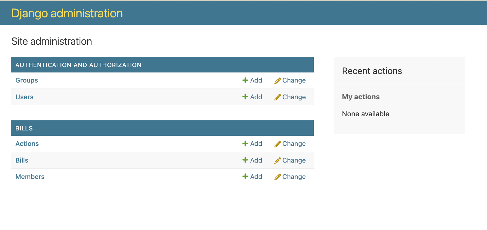
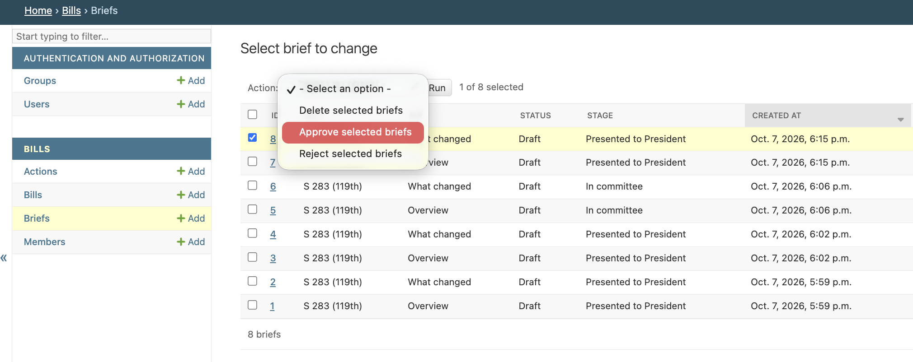
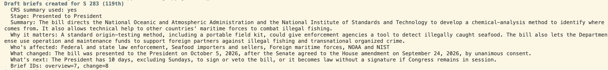
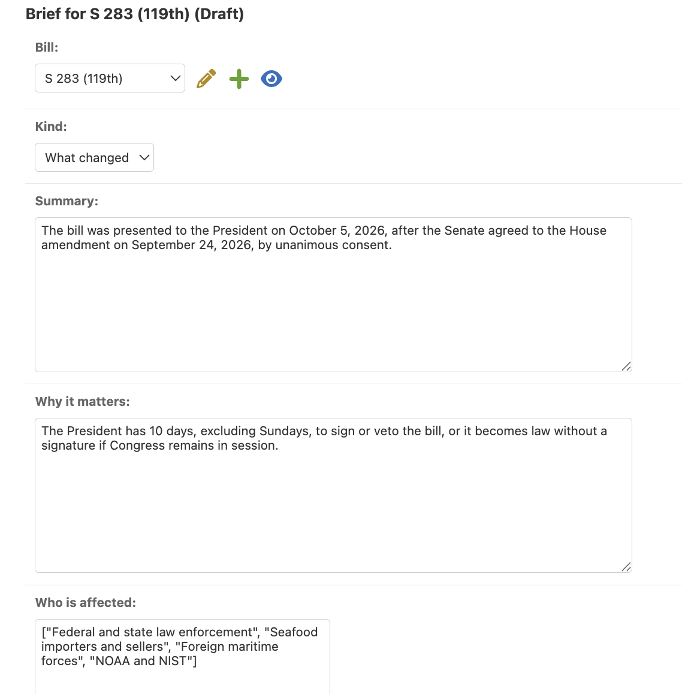
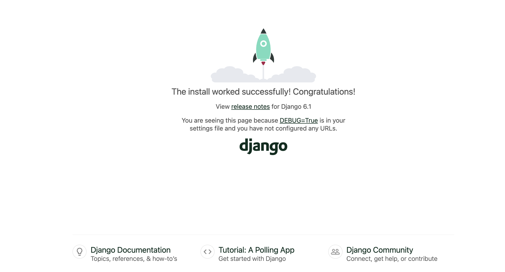
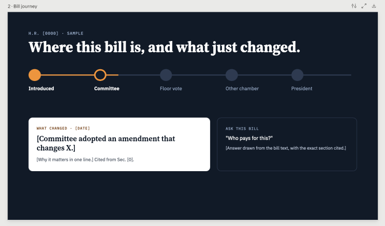

# BillBrief — Build Notes

AI-powered congressional bill tracker + HTML newsletter.

---

## October 8 — Production settings

**Moved secrets and environment settings out of `settings.py`**
- Generated a new secret key:
    python -c "from django.core.management.utils import get_random_secret_key; print(get_random_secret_key())"
- Added to `.env`: `DJANGO_SECRET_KEY`, `DJANGO_DEBUG=True`, `DJANGO_ALLOWED_HOSTS=localhost,127.0.0.1`
- In `settings.py` (after `load_dotenv()`):

    SECRET_KEY = os.environ["DJANGO_SECRET_KEY"]
    DEBUG = os.environ.get("DJANGO_DEBUG", "False") == "True"
    ALLOWED_HOSTS = os.environ.get("DJANGO_ALLOWED_HOSTS", "").split(",")

- Why: the original key from `startproject` was committed to the public repo; DEBUG now defaults to False (safe for production); ALLOWED_HOSTS will get the live domain on Railway
- Checked `git diff config/settings.py` for secrets before committing

**Lesson: `os.environ["X"]` vs `os.getenv("X")`**
- `os.environ["X"]` fails immediately with a clear error naming the missing variable; use it for required secrets
- `os.getenv("X", default)` returns None or a default silently; use it for optional settings with a safe default

## October 7 - Current-Congress sync, Anthropic setup

**1. Created a superuser** and confirmed all 3 models (Member, Bill, Action) in the Django admin.


**2. Scoped the sync to the current (119th) Congress**

- Problem: the sync returned 117th Congress bills (2021–22). The `fromDateTime` filter matches bills whose *records* were recently updated, including old bills touched by Congress.gov's data cleanup.
- Fix: added a `--congress` option (default 119) and changed the request from `/bill` to `/bill/{congress}`:

    parser.add_argument("--congress", type=int, default=119, help="Congress number")

- Result: the sync now returns only current bills (HR 45, HR 31, HR 211, HR 220, HR 227).
- Lesson: "updated" in an API often means the database record changed, not that something happened in Congress. Change tracking should rely on the Action table instead.

**3. Set up the Claude API**

- Created an API key in the Claude Console, named `billbrief-local` (stored in `.env` only)
- Installed the SDK: `pipenv install anthropic`

**4. Brief model and editorial workflow**

- Added a `Brief` model linked to `Bill`: summary, why it matters, who's affected, stage, `kind` (overview or what changed), and `status` (draft / approved / rejected)
- Audit fields: `reviewed_by`, `reviewed_at`, `model_name`
- Admin actions to approve or reject briefs in bulk; list shows ID, kind, and status



**5. generate_briefs command (Claude API)**

- Sends one bill to Claude with its title, sponsor, CRS summary, and action timeline; saves an overview brief and a "what changed" brief as drafts
- Structured output via a `save_brief` tool schema, so every brief has the same fields



Iterating on S. 283 (Illegal Red Snapper and Tuna Enforcement Act, presented to the President Oct 5):

1. Error: `tool_choice` type "tool" isn't supported for this model → switched to `auto`, with the system prompt requiring the tool call plus a guard if none comes back.
2. Draft 1: accurate, but long sentences, jargon ("IUU"), crammed labels → tightened the schema descriptions (word limits, short labels, spell out acronyms).
3. Draft 2: "What's next" told readers "the input does not give a deadline" → the code now supplies the constitutional 10-day rule when a bill reaches the President; the prompt forbids mentioning the input.
4. Draft 3: stage regressed to "In committee" → printed the exact context in the Django shell to debug; added the latest action near the top of the input.
5. Draft 4: correct. Approved briefs 7 and 8, rejected 1–6.

Principles:
- The code supplies the facts; the model only writes.
- When AI output looks wrong, check the input first.
- Edits to the brief happen on the edit page; approval happens through admin actions so the audit trail is recorded.



**6. Admin display**

- Times showed in UTC; set `TIME_ZONE = "America/Los_Angeles"` (the database still stores UTC)
---

## October 6 — Environment, Postgres, first sync

**1. Set up the environment**

```bash
pipenv shell
pipenv install django djangorestframework "psycopg[binary]" requests dj-database-url python-dotenv
django-admin startproject config .   # "config" = settings package; "." keeps manage.py at the repo root
python manage.py startapp bills      # the app
python manage.py runserver
```


**2. Pushed progress**

```bash
git add .
git commit -m "..."
git push
```

- Problem: push failed with `Failed to connect to github.com port 443`.
- Debugged: `curl -I https://github.com` returned 200, no proxy configured; it was a temporary network drop. Push succeeded on retry.

**3. Installed Docker Desktop** to run PostgreSQL locally

- Problem: `docker: command not found` right after install.
- Fix: the terminal was opened before Docker was installed; a fresh terminal picked up the new PATH.

**4. Postgres via Docker Compose**

- Created `docker-compose.yml` at the repo root (same level as `manage.py`)
- Ran `docker compose up -d`

**5. Config**

- Created `.env` with the Congress.gov API key and `DATABASE_URL` (confirmed with `git status` that `.env` is ignored)
- In `config/settings.py`:

```python
import dj_database_url
from dotenv import load_dotenv
load_dotenv()

DATABASES = {"default": dj_database_url.config()}
```

- Added `rest_framework` and `bills` to `INSTALLED_APPS`

**6. Models and ingestion**

- Models: `Member`, `Bill`, `Action`
- Ingestion command: `bills/management/commands/sync_bills.py`

```
bills/
├── models.py
└── management/
    ├── __init__.py
    └── commands/
        ├── __init__.py
        └── sync_bills.py
```

**7. Migrated and ran the first sync**

```bash
python manage.py makemigrations
python manage.py migrate
python manage.py sync_bills --days 3 --limit 5
```

- Problem: `ModuleNotFoundError: No module named 'django'`.
- Debugged: `which python` pointed to an old virtualenv (`...-O9mgv4Bi`) left over from an earlier install in the wrong folder, while `pipenv --venv` showed the project's real one (`...-m0y9PZYD`). Exited the stale shell, re-ran `pipenv shell`, and it worked.
- Also: first tried running migrations from the wrong folder level.

**8. Registered the 3 models in `admin.py`**

**Result:** sync worked: 5 bills saved to Postgres with actions.

- Finding: all 5 were from the **117th Congress**. The `fromDateTime` filter returns bills whose *records* were recently updated, which includes old bills. Next step: scope the sync to the current (119th) Congress.



---

## October 5 — Repo setup

1. Requested a Congress.gov API key (stored in `.env` only, never committed)
2. Created the GitHub repo: README, Python `.gitignore`, MIT license
3. Cloned it: `git clone https://github.com/aqcunningham/BillBrief.git`

---

## October 4 — Research and planning


**Visual ideas:** briefs feed, bill journey timeline, BillBrief Weekly email (see the BillBrief Visual Concepts canvas)